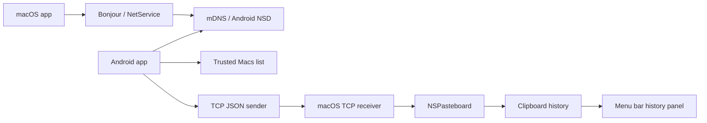
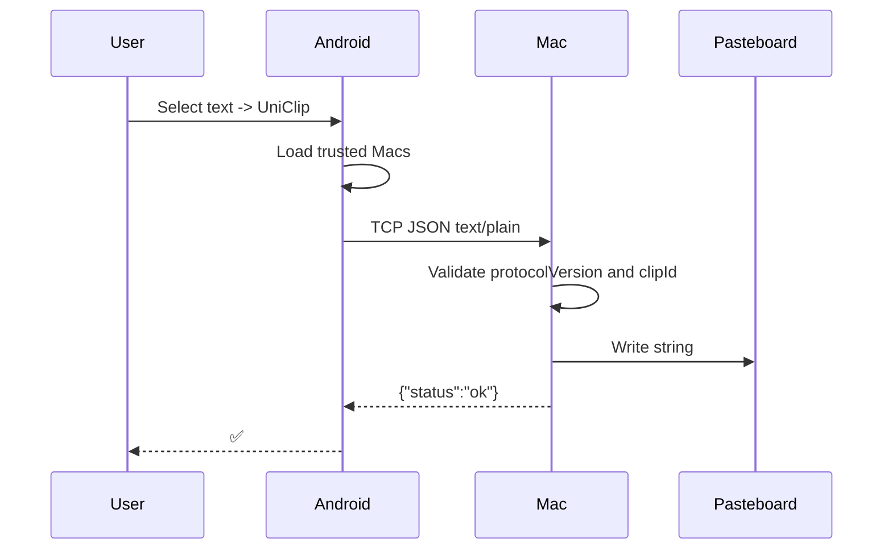
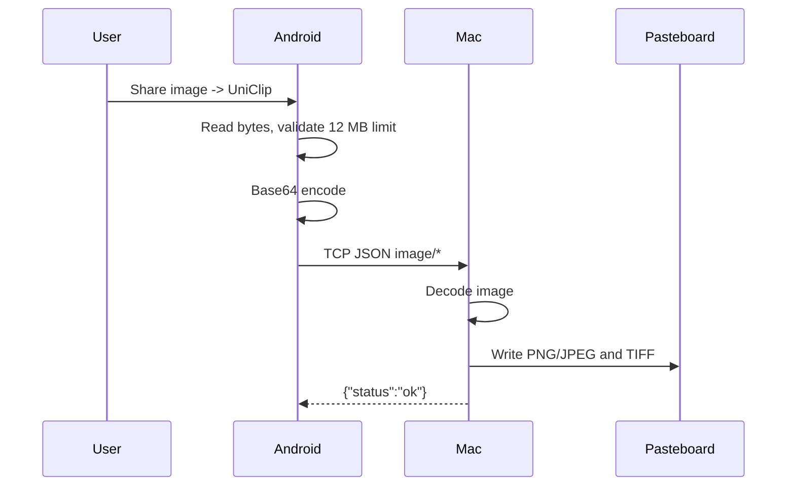

# UniClip Architecture

UniClip consists of two apps:

- Android sender - discovers Macs on the local network and sends content.
- macOS receiver - receives content, writes it to the system clipboard, and maintains local history.

## macOS

Path: `apps/macos`.

### `UniClipReceiver`

File: `apps/macos/Sources/UniClipMac/main.swift`.

Responsibilities:

- listens on TCP port `47191`;
- publishes Bonjour service `_uniclip._tcp.`;
- receives newline-delimited JSON;
- validates `protocolVersion`;
- rejects duplicate `clipId` values;
- limits message size to `20 MB`;
- writes text/images to `NSPasteboard`;
- returns JSON acknowledgement.

### `PasteboardWriter`

Writes payload to macOS pasteboard:

- `text/plain` -> `NSPasteboard.PasteboardType.string`;
- `image/png` -> `public.png` + `TIFF`;
- `image/jpeg` / `image/jpg` -> `public.jpeg` + `TIFF`.

### `ClipboardHistoryStore`

File: `ClipboardHistory.swift`.

Responsibilities:

- polls `NSPasteboard` every `0.45s`;
- stores history in process memory;
- deduplicates items with SHA-256;
- supports text and images;
- limits item count from `UserDefaults`;
- allowed limit range: `10...100`.

### `HistoryPopoverController`

File: `HistoryPopoverController.swift`.

History UI:

- search;
- text and image rows;
- hover highlight;
- clicking an item copies it to pasteboard;
- footer actions: clear, settings, about, quit;
- settings for history limit and hotkey.

### `HistoryPanel`

File: `main.swift`.

The history window is a borderless `NSPanel`, not an `NSPopover`. Reason: `NSPopover` has a system arrow, which does not match the current design.

### Global Hotkey

File: `HotKey.swift`.

Uses Carbon `RegisterEventHotKey`. Default shortcut is `Option + V`. User can change the shortcut in history-window settings.

### Automatic Paste

After a history item is selected, UniClip:

1. copies the item to `NSPasteboard`;
2. closes the history window;
3. activates the previous app;
4. sends `Cmd + V` using `CGEvent`.

macOS may require Accessibility permission for this event.

## Android

Path: `apps/android`.

### `MainActivity`

Management screen:

- `Scan` starts Mac discovery;
- `Stop` stops discovery;
- `Available Macs` shows discovered receivers;
- `Trusted Macs` shows saved Macs;
- `Add` saves an endpoint locally;
- `Remove` deletes an endpoint.

### `MacDiscovery`

File: `MacDiscovery.kt`.

Uses Android `NsdManager`:

- searches for `_uniclip._tcp.`;
- resolves service;
- returns `name`, `host`, `port`.

### `TrustRepository`

Stores added Macs locally. This is usability trust for now, not cryptographic trust.

### `ClipSender`

File: `ClipSender.kt`.

Responsibilities:

- creates `ClipMessage`;
- sends it to each trusted Mac;
- uses TCP socket timeout `3000ms`;
- reads ack;
- shows `✅` for `ok` and `duplicate`.

### `ProcessTextActivity`

Receives Android `Intent.EXTRA_PROCESS_TEXT` and sends selected text to all trusted Macs.

### `ShareReceiverActivity`

Receives Android share intents:

- `text/plain`;
- `image/*`;
- for `ACTION_SEND_MULTIPLE`, takes the first image;
- image limit: `12 MB`;
- encodes image bytes as Base64.

## Text Transfer Flow

## Image Transfer Flow

## Storage

Android:

- trusted Mac endpoints in app-local storage.

macOS:

- clipboard history in memory;
- history limit and shortcut settings in `UserDefaults`;
- no secrets yet, because cryptographic pairing is not implemented.

## Current Limits

- No E2E encryption.
- No cryptographic device identity.
- mDNS is only a locator.
- Android trusted list does not protect against spoofing.
- macOS history is not persisted.
- Payload is sent as one whole JSON message, no streaming.

## Target Security Model

Before production, UniClip needs:

- explicit pairing approval on macOS;
- device keypair on Android and macOS;
- peer public key pinning;
- authenticated encryption;
- nonce/timestamp/sequence replay protection;
- payload size limits per content type;
- MIME validation;
- pairing rate limits.
