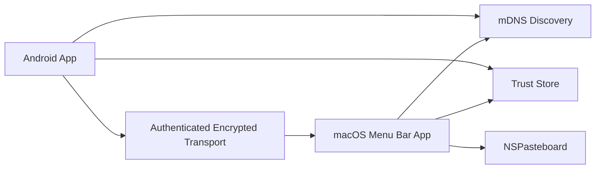

# UniClip Architecture

## Components

## Android App

Responsibilities:

- Discover Mac receivers in LAN.
- Request pairing with selected Mac.
- Store trusted Mac identities.
- Receive selected text via Android process-text action.
- Receive images/files via Android share sheet.
- Route payloads to all trusted online Macs.

## macOS App

Responsibilities:

- Advertise availability on LAN.
- Accept pairing requests.
- Store trusted Android identities.
- Receive encrypted payloads.
- Write supported content to pasteboard.
- Notify user about received content.

## Trust Boundary

LAN is untrusted. mDNS result is only a locator. A device becomes trusted only after explicit pairing approval on macOS.

## Default Routing

Android sends to all trusted online Macs. This keeps send UX low-friction when user owns several computers.

## Security Model

Threats:

- Unknown LAN device attempts to receive clipboard data.
- Unknown LAN device attempts to send malicious clipboard data.
- LAN attacker replays old payload.
- LAN attacker spoofs mDNS service.

Mitigations:

- Pairing approval on macOS.
- Persistent device keys.
- Authenticated encrypted transport.
- Peer key pinning.
- Nonce, timestamp, and sequence validation.
- Payload size and MIME validation.
- Short-lived pairing requests.
- Rate limits for pairing attempts.

## Storage

Android:

- Android Keystore for local private key.
- Encrypted local preferences or database for trusted peers.

macOS:

- Keychain for local private key and peer secrets.
- App settings for non-secret preferences.

## Clipboard Behavior

Text:

- Android sends UTF-8 text.
- macOS writes plain text to pasteboard.

Images:

- Android sends MIME type and bytes from share URI.
- macOS validates/normalizes data.
- macOS writes image-compatible pasteboard representation.

Files:

- Deferred until after image support unless required.
