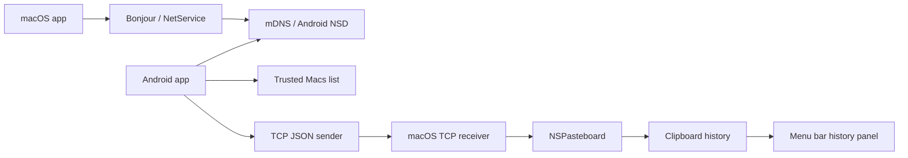
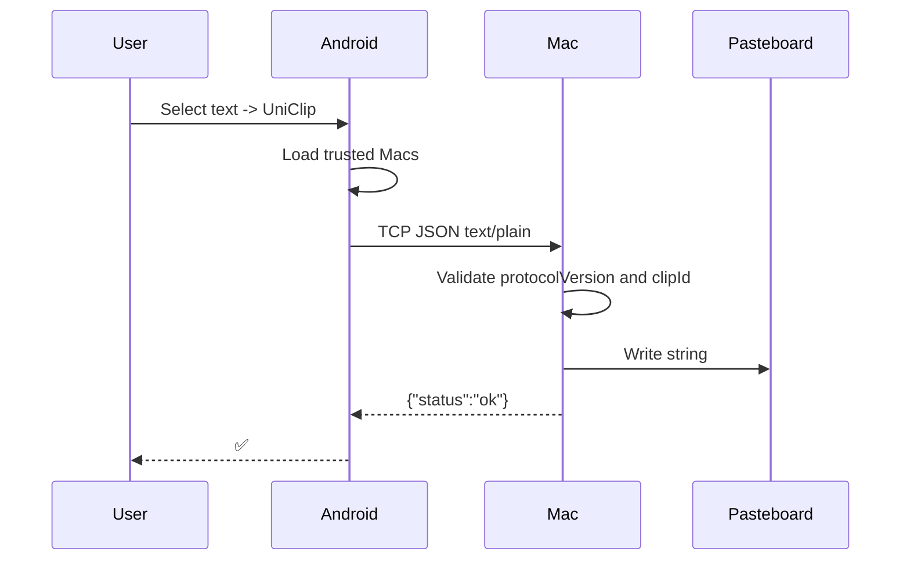
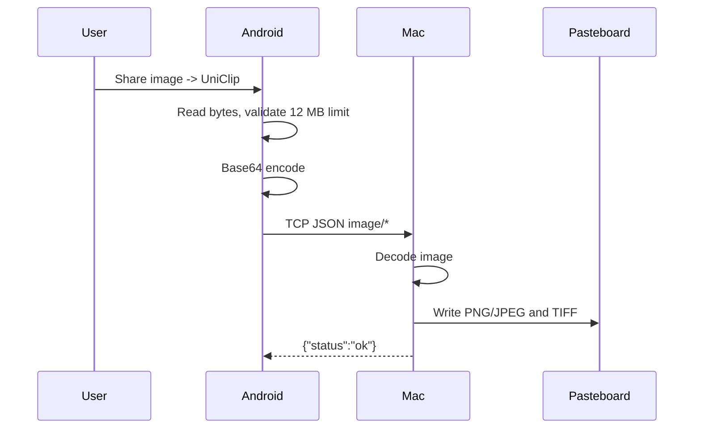

# Архитектура UniClip

UniClip состоит из двух приложений:

- Android sender - находит Mac в локальной сети и отправляет контент.
- macOS receiver - принимает контент, пишет его в системный буфер и ведет локальную историю.

## macOS

Путь: `apps/macos`.

### `UniClipReceiver`

Файл: `apps/macos/Sources/UniClipMac/main.swift`.

Задачи:

- слушает TCP port `47191`;
- публикует Bonjour service `_uniclip._tcp.`;
- принимает newline-delimited JSON;
- проверяет `protocolVersion`;
- отбрасывает повторные `clipId`;
- ограничивает размер сообщения `20 MB`;
- пишет текст/изображения в `NSPasteboard`;
- возвращает JSON acknowledgement.

### `PasteboardWriter`

Пишет payload в macOS pasteboard:

- `text/plain` -> `NSPasteboard.PasteboardType.string`;
- `image/png` -> `public.png` + `TIFF`;
- `image/jpeg` / `image/jpg` -> `public.jpeg` + `TIFF`.

### `ClipboardHistoryStore`

Файл: `ClipboardHistory.swift`.

Задачи:

- poll `NSPasteboard` каждые `0.45s`;
- хранит историю в памяти процесса;
- дедуплицирует элементы по SHA-256;
- поддерживает текст и изображения;
- лимитирует список значением из `UserDefaults`;
- диапазон лимита: `10...100`.

### `HistoryPopoverController`

Файл: `HistoryPopoverController.swift`.

UI истории:

- поиск;
- строки текста и изображений;
- hover highlight;
- клик по элементу копирует его в pasteboard;
- footer с действиями: очистить, настройки, о приложении, завершить;
- настройки лимита истории и горячей клавиши.

### `HistoryPanel`

Файл: `main.swift`.

Окно истории реализовано как borderless `NSPanel`, а не `NSPopover`. Причина: у `NSPopover` системная стрелка сверху, которая не нужна для текущего дизайна.

### Глобальная горячая клавиша

Файл: `HotKey.swift`.

Используется Carbon `RegisterEventHotKey`. По умолчанию `Option + V`. Пользователь может изменить shortcut в настройках окна истории.

### Автоматическая вставка

После выбора элемента истории UniClip:

1. копирует элемент в `NSPasteboard`;
2. закрывает окно истории;
3. активирует предыдущее приложение;
4. отправляет `Cmd + V` через `CGEvent`.

Для отправки события macOS может потребовать Accessibility permission.

## Android

Путь: `apps/android`.

### `MainActivity`

Экран управления:

- `Scan` запускает поиск Mac;
- `Stop` останавливает поиск;
- `Available Macs` показывает найденные receiver;
- `Trusted Macs` показывает сохраненные Mac;
- `Add` сохраняет endpoint в локальный trust list;
- `Remove` удаляет endpoint.

### `MacDiscovery`

Файл: `MacDiscovery.kt`.

Использует Android `NsdManager`:

- ищет `_uniclip._tcp.`;
- resolve service;
- возвращает `name`, `host`, `port`.

### `TrustRepository`

Локально хранит список добавленных Mac. Сейчас это usability trust, не cryptographic trust.

### `ClipSender`

Файл: `ClipSender.kt`.

Задачи:

- собирает `ClipMessage`;
- отправляет его на каждый trusted Mac;
- использует TCP socket timeout `3000ms`;
- читает ack;
- показывает `✅` для `ok` и `duplicate`.

### `ProcessTextActivity`

Принимает Android `Intent.EXTRA_PROCESS_TEXT` и отправляет выделенный текст на все trusted Mac.

### `ShareReceiverActivity`

Принимает Android share intent:

- `text/plain`;
- `image/*`;
- для `ACTION_SEND_MULTIPLE` берет первое изображение;
- лимит изображения: `12 MB`;
- кодирует image bytes в Base64.

## Поток передачи текста

## Поток передачи изображения

## Хранение данных

Android:

- trusted Mac endpoints в локальном хранилище приложения.

macOS:

- история буфера в памяти;
- настройки лимита истории и shortcut в `UserDefaults`;
- секреты пока не хранятся, потому что cryptographic pairing не реализован.

## Текущие ограничения

- Нет E2E encryption.
- Нет cryptographic device identity.
- mDNS используется только как locator.
- Trusted list на Android не защищает от spoofing.
- Нет persistence для истории macOS.
- Payload передается целиком, streaming нет.

## Целевая security-модель

Перед production нужны:

- explicit pairing approval on macOS;
- device keypair на Android и macOS;
- peer public key pinning;
- authenticated encryption;
- nonce/timestamp/sequence replay protection;
- payload size limits per content type;
- MIME validation;
- pairing rate limits.
